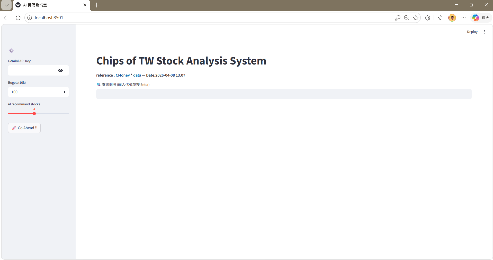
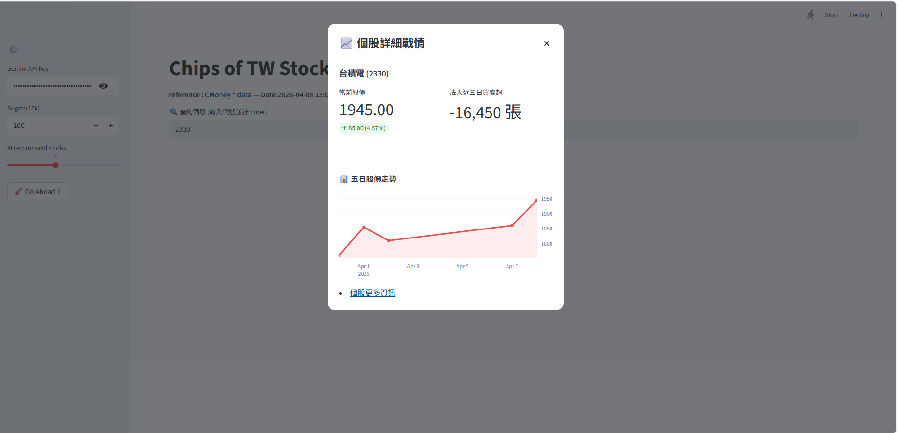
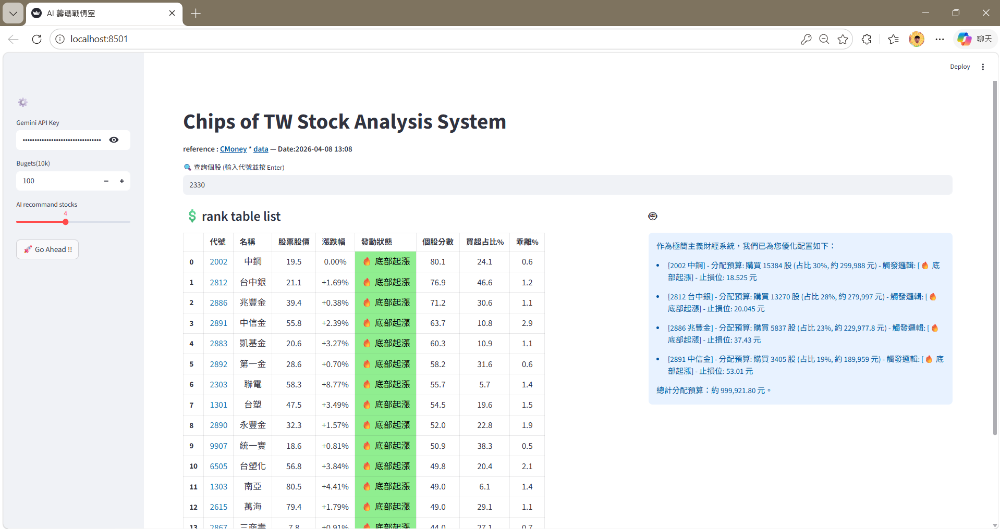
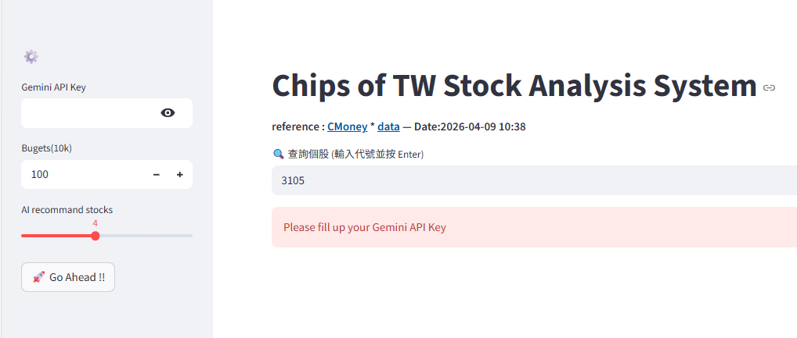

# AI 籌碼推薦分析系統( Chips of TW Stock Analysis System )
**結合量化成本建模、即時數據爬蟲與 LLM 資金配置的投資輔助系統**

本專案旨在解決投資者在面對大量法人籌碼數據時的資訊不對稱，透過自動化分析協助使用者鎖定關鍵起漲股。
本系統除了根據三大法人於一周內大買的股票中推薦15檔股票外，使用者亦可自行搜尋股票並評估資訊。

## 專案背景與動機
* **資訊超載**：法人買賣超數據頻繁更新，一般投資者難以即時計算出籌碼的集中度與持有成本。
* **決策盲點**：單純的籌碼增加不代表股價會漲，本專案加入「乖離率」與「主力成本線」交叉比對，提升預測精準度。
* **專案目的**：建構一套從數據抓取到「AI 擬定操作計畫」的一站式投資決策工具。
  
## 系統架構與技術實作數據挖掘
自動爬取市場法人買賣超前 50 名個股，並支援手動即時搜尋。
量化建模 (Quant Modeling)：計算 5 日 VWAP (主力成本) 與乖離率，識別個股是否處於底部安全區間。
AI 配置建議：整合 Gemini 2.5 Flash 根據預算自動分配張數，並設定 5% 止損位。

## 檔案結構
├── assests/
├── .env
├── .env.example
├── .gitignore
├── API_key.txt
├── app.py
├── path.txt
├── README.md
└── requirements.txt

---
## 系統介面展示

| 即時個股診斷 (搜尋功能) | 籌碼排行與 AI 配置建議 |
| :---: | :---: |
|  |  |
| :---: | :---: |
|  |  |
> *圖一：使用者最初進入頁面。圖二：使用者可手動輸入代號（如：2330），系統將即時抓取法人三日買賣超動向並繪製互動走勢圖。圖三：統根據量化模型篩選出推薦清單，並由 Gemini AI 擬定資金配置計畫。圖四：未輸入API Key 則無法使用LLM模型。*
---

---
## 快速開始
安裝依賴套件

Bash
pip install -r requirements.txt

設定環境變數
建立 .env 檔案並填入你的 API Key：

GEMINI_API_KEY=your_actual_key_here
啟動系統

Bash
streamlit run app.py
---

---
## 免責聲明
本系統僅供學術研究與程式開發技術交流使用，不構成任何投資建議。投資人應獨立判斷風險並自負盈虧。
---